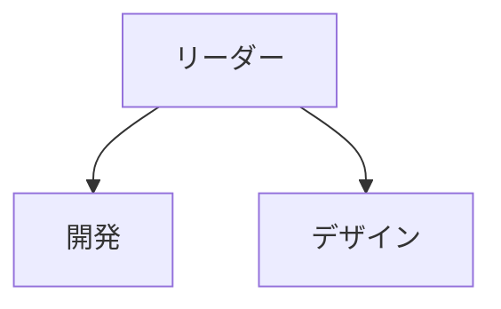

このファイルはorg-chart SKILLの一部です。生成時に使用する全テンプレートを集約します。

---

# テンプレート集

---

## CLAUDE.md テンプレート

各役割の `CLAUDE.md` は以下のフォーマットで生成する。
規模や文脈に応じて不要なセクションは省略してよい。

**オーケストレーター役割**には `## オーケストレーター実行プロトコル` を追加する。
**ワーカー役割**には `## サブエージェント実行プロトコル` を追加する。

### オーケストレーター版

```markdown
# [役割名]

## ミッション
[この役割が果たす責務の概要]

## 責任範囲
- [具体的な責任1]
- [具体的な責任2]
- ...

## 意思決定権限
- [この役割が独断で決定できる事項]
- [上位承認が必要な事項]

## レポートライン
- 上位: [上位の役割（なければ「なし」）]
- 配下: [配下の役割（なければ「なし」）]

## 主要タスク
- [定常的に行うタスク]
- ...

## コミュニケーション
- [誰とどのような情報をやり取りするか]

---

## オーケストレーター実行プロトコル

> [役割名]はタスク管理のみ担当。実装・調査・検証はすべてサブエージェントに委譲する。

### ロール別 推奨モデル

| ロール | モデル | 理由 |
|--------|--------|------|
| [ワーカー役割名] | `sonnet` / `opus` / `haiku` | [理由] |

### 委譲プロンプトに必ず含める情報

```
あなたは[ロール名]です。以下のタスクを実行してください。

## 現在状態
[前のサブエージェントから引き継いだ状態]

## タスク
[具体的な作業内容]

## 完了条件
[何ができたら完了か]

## 完了報告フォーマット
- 実施内容の概要
- 完了項目 / 未完了項目
- 次タスクへの申し送り事項
```
```

### ワーカー版

```markdown
# [役割名]

## ミッション
[この役割が果たす責務の概要]

## 責任範囲
- [具体的な責任1]
- [具体的な責任2]
- ...

## 意思決定権限
- [この役割が独断で決定できる事項]
- [上位承認が必要な事項]

## レポートライン
- 上位: [上位の役割（なければ「なし」）]
- 配下: [配下の役割（なければ「なし」）]

## 主要タスク
- [定常的に行うタスク]
- ...

## コミュニケーション
- [誰とどのような情報をやり取りするか]

---

## サブエージェント実行プロトコル

推奨モデル: `sonnet` / `opus` / `haiku`（ステップ3.5で確定した値を記載）

### 完了報告フォーマット（必ずこの形式で返答）

```
## 実施内容
[実施した作業の概要]

## 完了状況
- [タスク項目] / 

## 申し送り事項
[次のサブエージェントが知っておくべき情報]
```
```

---

## 組織図テンプレート（org/README.md）

全体の組織図を `org/README.md` に Mermaid 記法で生成する:

```markdown
# 組織図



## 役割一覧

| 役割 | ディレクトリ | 概要 | スキル | ルール | モデル |
|------|-------------|------|--------|--------|--------|
| ... | ... | ... | `/ask-<name>` | `rules/role-<name>.md` | opus/sonnet/haiku |

## ワークフロー

| ワークフロー | パターン | 参加ロール | スキル |
|-------------|---------|-----------|--------|
| タスクチェック | SubAgent | PM→秘書,SW,リサーチャー | `/ask-pm` |
| 設計レビュー | Agent Team | PM,エンジニア,QA | `/team-design-review` |

## ハーネス設定状況

| 要素 | 状態 |
|------|------|
| Rules | role-*.md × N件 |
| Skills (個別) | ask-*/SKILL.md × N件 |
| Skills (チーム) | team-*/SKILL.md × N件 |
| Workflows | workflows/*.md × N件 |
| Hooks | SessionStart, PreToolUse |
| Agent Team | 有効 / 無効 |
```

---

## settings.json マージ用テンプレート

```json
{
  "env": {
    "CLAUDE_CODE_EXPERIMENTAL_AGENT_TEAMS": "1"
  },
  "hooks": {
    "SessionStart": [
      {
        "matcher": "",
        "hooks": [
          {
            "type": "command",
            "command": "node .claude/hooks/session-init.cjs",
            "timeout": 10,
            "statusMessage": "Initializing session..."
          }
        ]
      }
    ]
  }
}
```

> Agent Team パターンを使わない場合は `env` ブロックを省略する。

---

## session-init.cjs テンプレート（`.claude/hooks/session-init.cjs`）

```javascript
#!/usr/bin/env node
const fs = require('fs');
const path = require('path');

const root = process.cwd();
const output = [];

// NEXT-SESSION.md
const next = path.join(root, 'NEXT-SESSION.md');
if (fs.existsSync(next)) {
  output.push('[Session] 引き継ぎ事項あり:\n' + fs.readFileSync(next, 'utf-8').trim());
}

// 組織構成
const orgDir = path.join(root, 'org');
if (fs.existsSync(orgDir)) {
  const roles = fs.readdirSync(orgDir).filter(d =>
    fs.statSync(path.join(orgDir, d)).isDirectory() &&
    fs.existsSync(path.join(orgDir, d, 'CLAUDE.md'))
  );
  output.push(`[Org] ${roles.length} ロール: ${roles.join(', ')}`);
}

// ルール数
const rulesDir = path.join(root, '.claude', 'rules');
if (fs.existsSync(rulesDir)) {
  const rules = fs.readdirSync(rulesDir).filter(f => f.endsWith('.md'));
  output.push(`[Rules] ${rules.length} 件のルールを検出`);
}

if (output.length > 0) console.log(output.join('\n'));
```
